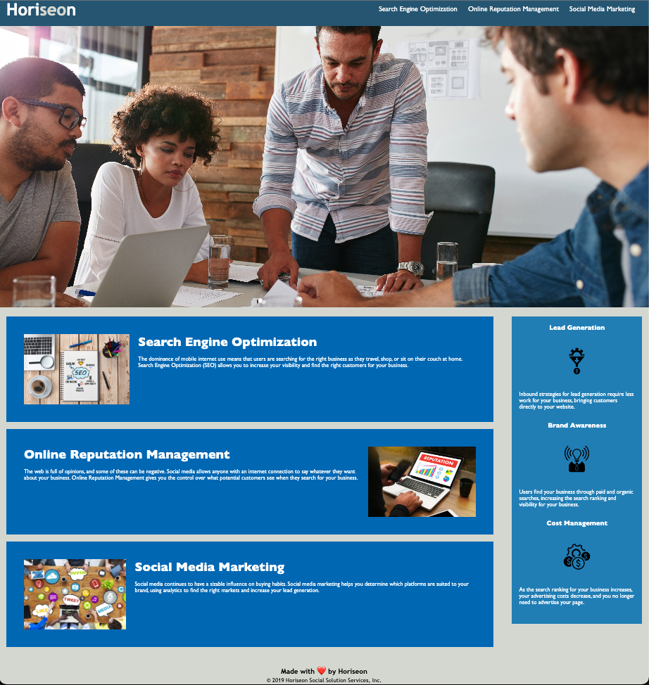

# Module-1-Challenge
# Horiseon Media Marketing 

## This is a refactoring challenge that allows a user to have a more accessible site to view. 

Short Description on the project. 
- The site should meet accessibility standards.
- Learning objective was to be able to refactor a site to reflect semantic elements, adding additional classes where needed, styling the css style sheet to avoid repetitive code. 
- Allows a user to have a prettified code to view.

